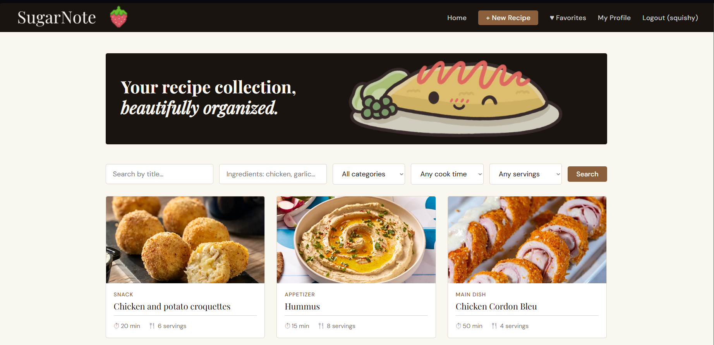
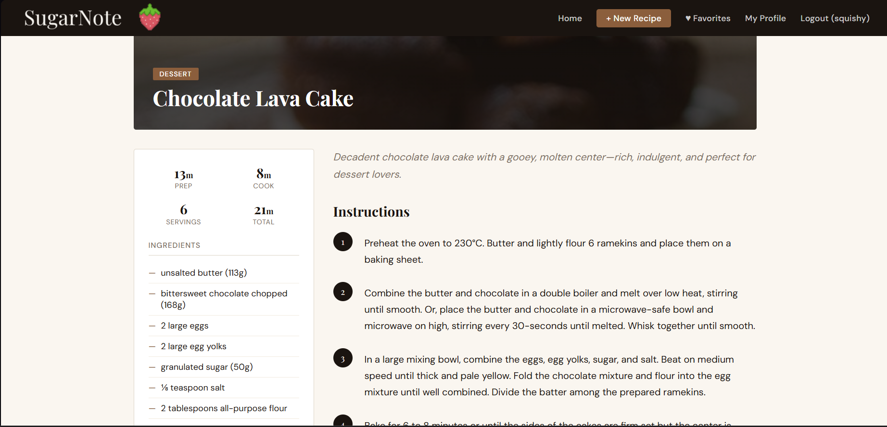
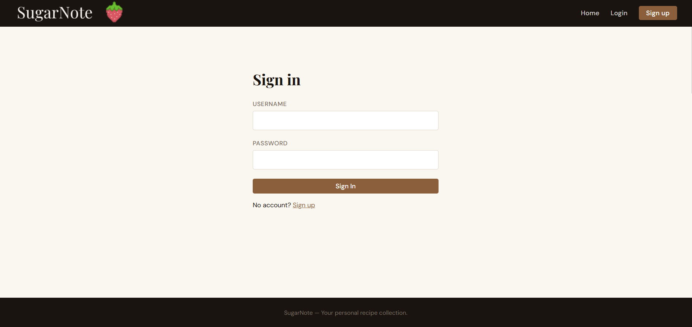
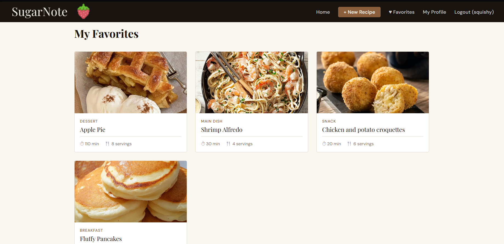

# SugarNote Web

A recipe manager web app built with Flask and deployed on Render.

## Features
- Browse and search recipes
- Filter by category, ingredients, cook time and servings
- Create, edit and delete recipes
- User accounts and authentication
- Favorite recipes
- User profiles
- Image upload via Cloudinary

## Tech Stack
- Backend: Python Flask
- Database: PostgreSQL on Supabase
- Image storage: Cloudinary
- Hosting: Render
- Mobile app: https://github.com/squiiishyyy/SugarNote-mobile-app

## Local Development
1. Clone the repo
2. Create a virtual environment: `python -m venv venv`
3. Activate it: `venv\Scripts\activate`
4. Install dependencies: `pip install -r requirements.txt`
5. Run: `python app.py`

## Screenshots

